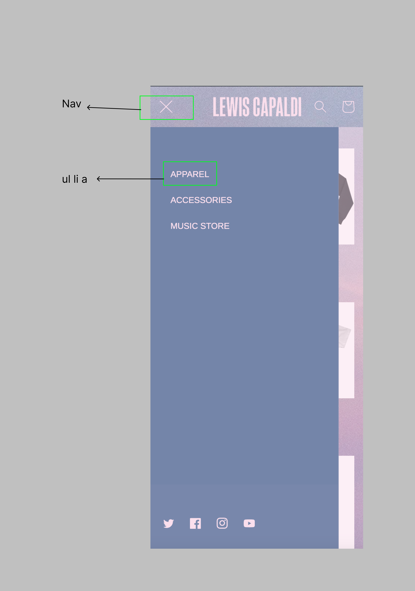

# Procesverslag
Markdown is een simpele manier om HTML te schrijven.  
Markdown cheat cheet: [Hulp bij het schrijven van Markdown](https://github.com/adam-p/markdown-here/wiki/Markdown-Cheatsheet).

Nb. De standaardstructuur en de spartaanse opmaak van de README.md zijn helemaal prima. Het gaat om de inhoud van je procesverslag. Besteedt de tijd voor pracht en praal aan je website.

Nb. Door *open* toe te voegen aan een *details* element kun je deze standaard open zetten. Fijn om dat steeds voor de relevante stuk(ken) te doen.

## Jij

  
uitwerken voor kick-off werkgroep

  ### Auteur:
  Jeppe de Wilde

  #### Je startniveau:
  Rood

  #### Je focus:
  Surface plane
 

## Je website

  
uitwerken voor kick-off werkgroep

  ### Je opdracht:
  https://www.lewiscapaldi.com/

  #### Screenshot(s) van de eerste pagina (small screen): 
  Home pagina  
  

  #### Screenshot(s) van de tweede pagina (small screen):

  Watch pagina + sign up pagina
  
  
 

## Toegankelijkheidstest 1/2 (week 1)

  
uitwerken na test in 2e werkgroep

  ### Bevindingen
  Lijst met je bevindingen die in de test naar voren kwamen:
  - Pagina's hebben geen unieke titels
  - Pagina's hebben geen heading elementen
  - Er is geen keyboard focus
  - Nav links op mobiele weergave zijn klein en verspreid, hierdoor zijn deze niet makkelijk aan te klikken
  - Links in de footer staan te dicht op op elkaar
  - Img elementen hebben geen alt
  - Geen a elementen voor links
  - Links zijn niet te herkennen als links
  - Er is geen skip link
  - Links die een nieuw tablad openen zonder dat dat van tevoren duidelijk is
  - Geen light/dark mode
  - Geen high-contrast mode
  - Animaties veranderen niet bij prefers-reduced-motion media query
  - Kleur contrast is niet goed genoeg bij normale tekst, icons en tekst die een afbeelding overlapt
  - geen custom ::selection colors

## Breakdownschets (week 1)

  
uitwerken na afloop 3e werkgroep

  
  Ik was eerst van plan om de 'Watch' pagina te maken, maar heb later toch besloten om de 'Merch' pagina te doen, de merch pagina is ook te zien in deze breakdownschets

  ### de hele pagina: 
  

  ### dynamisch deel (bijv menu): 
  

## Voortgang 1 (week 2)

  
uitwerken voor 1e voortgang

  ### Stand van zaken
  eigenlijk gaat het over het algemeen best goed. Ik begrijp alle oefeningen en kom hier goed doorheen.
  we zijn natuurlijk nog niet echt begonnen met de website, op de eerste html na, dus over die voortgang valt nog niet heel veel te zeggen.

  ### Agenda voor meeting

  | Sabrina        | Rafi               | Jeppe        | 
  | ---            | ---                | ---          | 
  | Q's eigen code | copyright/bronnen? | achtergronden|        

  ### Verslag van meeting

  - taal bovenin html veranderen
  - title veranderen
  - elke a in de nav een li eromheen
  - tip over de achtergrond: dowloaden vanuit inspector en in de html of css zetten (kan beide)

## Voortgang 2 (week 3)

  
uitwerken voor 2e voortgang

  ### Stand van zaken
  Ik begon hier goed op gang te komen en mijn website maakte aardig vaart. Het grootste deel stond hier eigenlijk al. Wat ik nog moet doen zijn eigenlijk alleen 
  de surface plane, zoals animaties, en vette dingen, zoals een werkende dropdown selector en een verborgen zoekbalk. Wat ik tot nu toe het lastigst vond waren de foto's als 
  achtergrond op de homepagina. Het was even flink aanklooien en vanalles proberen tot die netjes stonden en op de achtergrond scrollbaar waren. Ook heb ik nog best lopen       
  priegelen met het positioneren van de nav elementen, maar uiteindelijk is dit wel gelukt.

  ### Agenda voor meeting

  | Sabrina        | Ravi            | Jeppe                                 | 
  | ---            | ---             | ---                                   | 
  | Q's eigen code | Q's eigen code  | Nav links waar geen pagina van is?    | 
  | -              | -               | Mag 2 styles pagina's?                | 

  ### Verslag van meeting

  - alle linkjes naar je 2e pagina laten gaan
  - merch pagina section article ipv div section
  - 2 styles pagina's is prima voor mij

## Toegankelijkheidstest 2/2 (week 4)

  
uitwerken na test in 9e werkgroep

  ### Bevindingen
  Lijst met je bevindingen die in de test naar voren kwamen (geef ook aan wat er verbeterd is):

## Voortgang 3 (week 4)

  
uitwerken voor 3e voortgang

  ### Stand van zaken
  Ik had hier wel wat verder gepriegeld aan de site en had onder andere gewerkt aan een zoekbalk die verschijnt nadat er op het icoontje van een vergrootglas
  wordt geklikt. Ik vond dit lastiger dan verwacht, maar uiteindelijk was de code ook juist wel weer heel logisch. Ik heb dit gedaan met javascript. Er waren nog wel wat dingen 
  waar ik tegenaan liep. Ik kreeg het namelijk niet voor elkaar om de zoekbalk over de rest van de header heen te krijgen, terwijl ik wel de order had veranderd.
  

  ### Agenda voor meeting
  samen met je groepje opstellen

  | Sabrina        | Ravi            | Jeppe                                                | 
  | ---            | ---             | ---                                                  | 
  | Q's eigen code | Q's eigen code  | Zoekbalk wil niet over de rest van de header heen    | 
  | -              | -               | Footer op de home pagina blijft niet staan           | 

  ### Verslag van meeting
  
  - Ik ben geholpen met het oplossen van de problemen met de zoekbalk en de footer door de studentassistente.

## Eindgesprek (week 5)

  
uitwerken voor eindgesprek

  ### Je uitkomst - karakteristiek screenshots:
  

  ### Dit ging goed/Heb ik geleerd: 
  Korte omschrijving met plaatjes

  

  ### Dit was lastig/Is niet gelukt:
  Korte omschrijving met plaatjes

  

## Bronnenlijst

  
continu bijhouden terwijl je werkt

  Nb. Wees specifiek ('css-tricks' als bron is bijv. niet specifiek genoeg). 
  Nb. ChatGpT en andere AI horen er ook bij.
  Nb. Vermeld de bronnen ook in je code.

  1. bron 1
  2. bron 2
  3. ...

